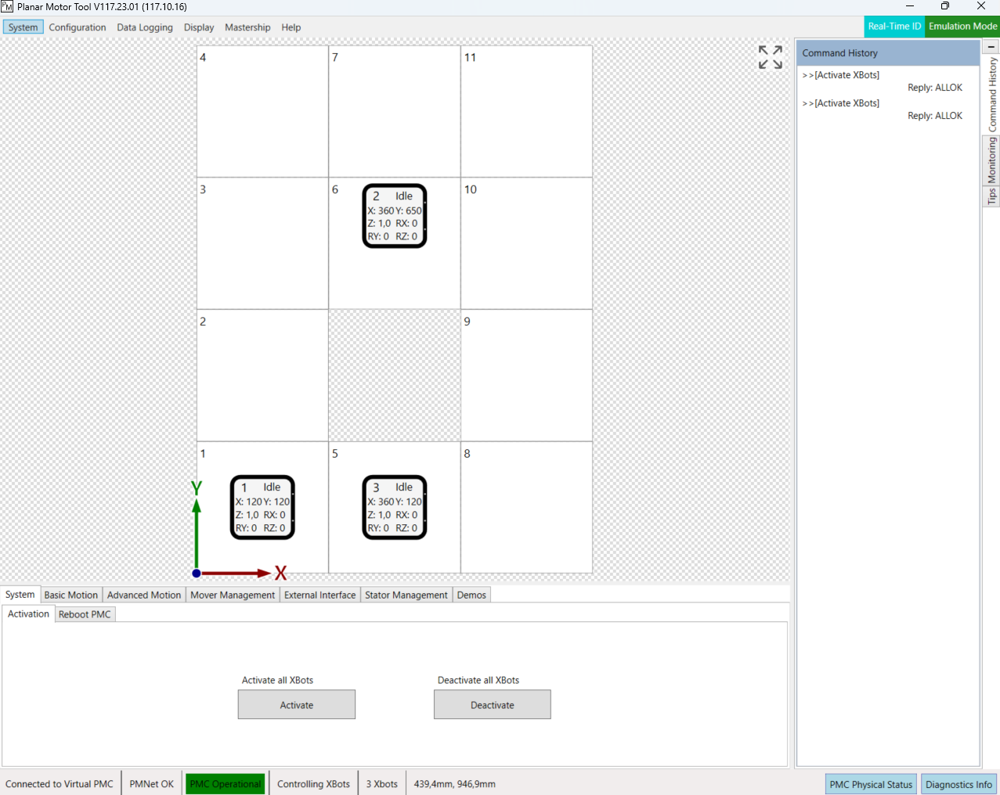
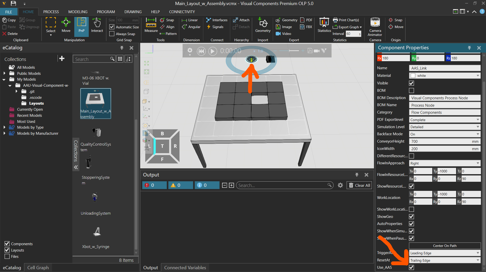
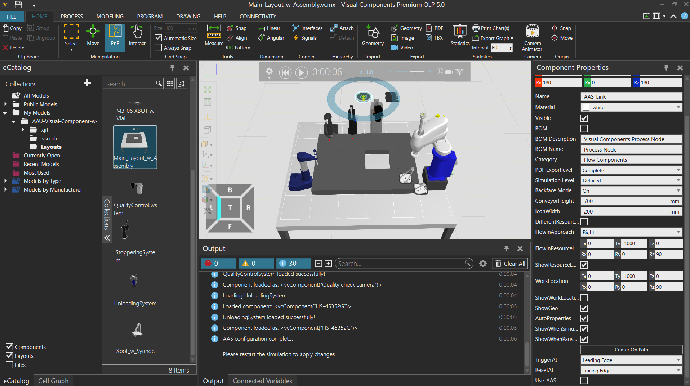
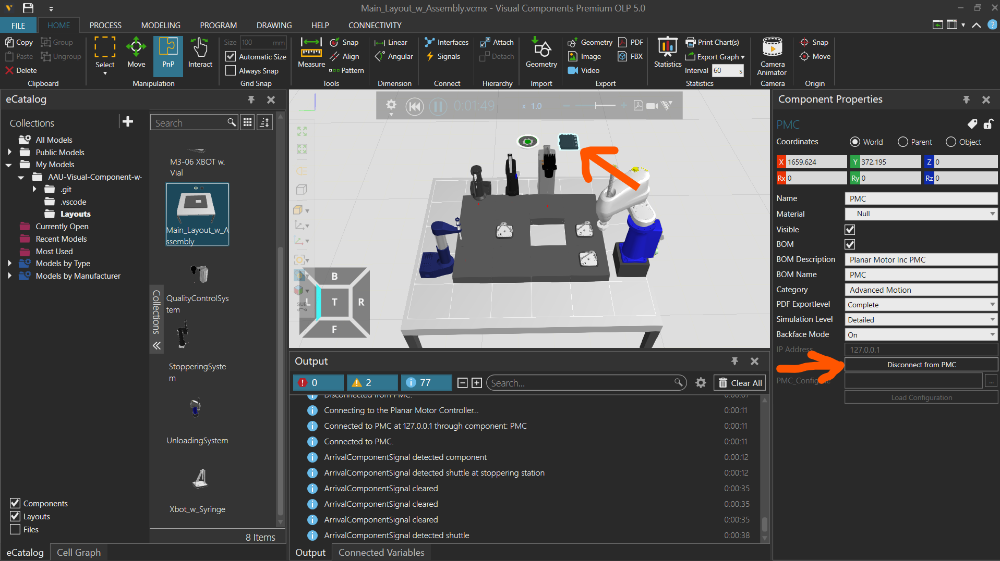

# AP2030-UNS with Visual Components
This branch is used when running the PackML Stations in Visual Components. It contains modified proxies from the main branch, which forwards MQTT command messages to Visual Components to run simulated processes. In a distributed setup this is supposed to run on the same PC, as the Visual Components simulation and the Planar Motor Simulator.

# Start Planar Motor Simulation
Start the two hour free simulation in Planar Motor Simulation and ensure that the layout has been configured in the Planar Motor Tool to look like this:



Activate the shuttles to prepare for movements.

> [!NOTE] 
> The planar motor tool and simulation can be downloaded from the links below
> 
>[Planar Motor Simulation](https://www.br-automation.com/en/downloads/mechatronic-systems/acopos-6d/planar-motor-simulation-tool/)
>
>[Planar Motor Tool](https://docs.planarmotor.com/tech-portal/downloads)
# Configuration
Before running the system, configure your environment:

```bash
    # Copy the example environment file
    cp .env.example .env
    
    # Edit .env and set PMC_IP to localhost (default) or to the PC/controller running the PMC. 
    #PMC_IP is only relevant when running Planar_Controller on the same PC.
    # Set MQTT_Broker to the IP address of PC running the main branch.
    nano .env
```

# Build and run docker containers
At first, build and run the compose file without stations in the main branch on external PC:

```bash
    cd AP2030-UNS
    docker compose -f docker-compose.nostations.yml build --parallel
    docker compose -f docker-compose.nostations.yml up -d
```

Then build and run this branch on the simulation PC:

```bash
    cd AP2030-UNS
    docker compose build --parallel
    docker compose up -d
```

# Open Visual Components
Make sure to place the "Layouts" folder containing all the Visual components files under "C:\Users\xxxxx\Documents\Visual Components\5.0\My Models". This can be done by copy pasting the layouts folder or by cloning this repo directly into the "My Models" folder. 

Now open the "Main_Layout_w_Assembly.vcmx" file in Visual Components and make sure to tick the "USE_AAS" box under propertiers on the shown process executor (AAS_Link).



When running the simulation the stations that has been configured and sent to the AAS from the Frontend application running on the Main branch, will be retrieved and placed according to the defined configuration.



The simualtion will be paused and must be reset and started agian to initiliazie all stations properly. Notice that the "USE_AAS" box has been automatically unticked to prevent duplicating stations when restarting the simulation. 

After starting the Planar Motor Controller within Visual Components must be disconnected and reconnected to the Planar Motor Simualtion to properly initilize the xbots. When reconnecting the xbots should be automatically placed according to the layout defined in the Planar Motor Tool. Notice, the IP Address has been set to 127.0.0.1 (localhost) - can be changed when resetting the simulation.



The simulation is now prepared to run any orders that will be planned and sent using the AAS running on Main branch.

# Implementation details
The AAS_Link process executor loads stations into the main layout using a python script that sends an HTTP request to the AAS (running on another PC or server) to get the stations within the BOM of the aauFillingLineAAS. From these stations the locations can also be retrieved, which is used to place them in the world, accordingly.


Each station that is loaded into Visual Components has an associated python script, which enables it to communicate with its corresponding proxy (see PackML_Stations folder) using MQTT. When any command is retrieved the python scripts will execute the station's process and respond to the proxy afterwards.

The xbots are moved around in VC by shadowing the movements of the Planar Motor Simulation after it receives commands from the behaviour tree controller (the unit orchestrating the processes for a given order).